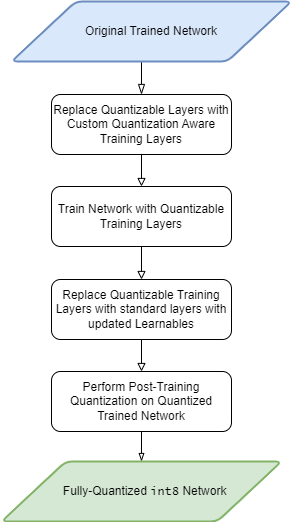

# Quantization Aware Training with MobileNet-v2

This example shows how to perform quantization aware training as a way to prepare a network for quantization. Quantization aware training is a method that can help recover accuracy lost due to quantizing a network to use 8-bit scaled integer weights and biases. Networks like MobileNet-v2 are especially sensitive to quantization due to the significant variation in range of values of the weight tensor of the convolution and grouped convolution layers.

This example shows how pre-processing a network with quantization aware training can produce a quantized network with accuracy on par with the original unquantized network. Note that the values in this table may differ slightly.

| Network      | Accuracy |
| ----------- | ----------- |
| Original network      | **0.9101**       |
| `int8` network via post-training quantization   | 0.2452        |
| `int8` network via quantization aware training   | **0.8937**        |

## **Running the Example**

Open and run the live script `QuantizationAwareTrainingWithMobilenetv2.mlx`.

Additional files:

- `QuantizedConvolutionBatchNormTrainingLayer`: Custom layer that implements quantization aware fused convolution-batch normalization layer
- `QuantizedConvolutionTrainingLayer`: Custom layer unused in this example but can be applied to networks with convolution layers without batch normalization
- `IdentityTrainingLayer`: No-op layer that acts as a placeholder for batch normalization layers.
- `quantizeToFloat`: Function to quantize the values to a floating point representation.
- `bypassdlgradients`: Function to perform straight through estimation for a given operation.
- `foldBatchNormalizationParameters`: function to calculate the adjusted weights and bias for dlnetwork that contains a convolution layer followed by a batch normalization layer.

### Requirements

- [MATLAB](https://www.mathworks.com/products/matlab.html) version R2022b or later
- [Deep Learning Toolbox](https://www.mathworks.com/products/deep-learning.html)
- [Deep Learning Toolbox Model Quantization Library](https://www.mathworks.com/matlabcentral/fileexchange/74614-deep-learning-toolbox-model-quantization-library)

## About Quantization Aware Training

This example focuses on the steps of a quantization workflow:

- Replace quantizable layers in a floating-point network with quantization aware training layers.
- Train with the quantzable training layers until reaching convergence.
- Replace the quantizable training layers back with the original layers with updated learnables more robust to quantization.
- Perform post-training quantization on this network to produce a fully-quantized int8 network.

During training, the quantization aware convolution layers quantized the weights and activations of the layer at each forward pass. The function, `quantizeToFloat` is used to quantize the values to a floating point representation using `single` type. This operation is akin to quantizing a value to integer and then immediately rescaling the value back to the real-world representation.

As an example, `quantizeToFloat`  would take an input value `365.247` and calculates a scaling factor that is used to scale the value to an integer representation of `91`. The integer value of `91` is then rescaled back to `364` introducing a absolute error of `-1.247`.

$$
\begin{align}
\hat x &=  quantizeToFloat\left(\mathrm{𝑥}\right) \\
\; &= \mathrm{unquantize}\left(\mathrm{quantize}\left(\mathrm{𝑥}\right)\right) \\
\; &= \mathrm{rescale}\cdot \mathrm{saturate}\left(\mathrm{round}\left(\frac{\mathrm{𝑥}}{\mathrm{scale}}\right)\right)
\end{align}
$$

The quantization step uses a non-differentiable operation `round` that would normally break the training workflow by zeroing out the gradients. During quantization aware training, bypass the gradient calculations for non-differentiable operations using an identity function. The diagram below \[2\] shows how the custom layer calculates the gradients for non-differentiable operations with the identity function via straight-through estimation.

After training, the network returned from the `trainNetwork` function still has the quantization aware training layers. Replace the quantization aware training operators with operators that are specific to inference. Whereas the training graph operates on pseudo-quantized 32-bit floating-point values, in the inference graph, the network applies the convolution using `int8` inputs and weights.

| Conovolution Operation Graph at Training   | Convolution Operation Graph at Inference |
| ----------- | ----------- |
|    | |

## **References**

1. The TensorFlow Team. Flowers [http://download.tensorflow.org/example_images/flower_photos.tgz](http://download.tensorflow.org/example_images/flower_photos.tgz)
2. Gholami, A., Kim, S., Dong, Z., Mahoney, M., & Keutzer, K. (2021). A Survey of Quantization Methods for Efficient Neural Network Inference. Retrieved from [https://arxiv.org/abs/2103.13630](https://arxiv.org/abs/2103.13630)
3. Jacob, B., Kligys, S., Chen, B., Zhu, M., Tang, M., Howard, A., Adam, H., & Kalenichenko, D. (2017). Quantization and Training of Neural Networks for Efficient Integer-Arithmetic-Only Inference. Retrieved from [https://arxiv.org/abs/1712.05877](https://arxiv.org/abs/1712.05877)

Copyright 2023 The MathWorks, Inc.

<!---TODO: update link-->
