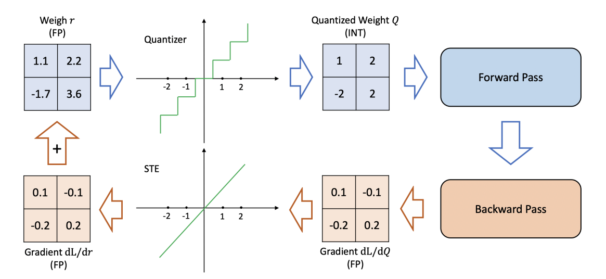
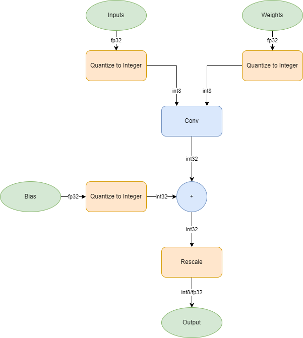

# Quantization Aware Training with Mobilenetv2

This example shows how to perform Quantization Aware Training as a way to prepare a network for quantization. Quantization Aware Training is a method that can help recover accuracy lost due to the quantization error from using int8 data types. Networks like mobilenetv2 are especially sensitive to int8 quantization due to the fact that the weight tensor of the convolution and grouped convolution layers may have significant variation in range of values.

This example will show how pre-processing a network with Quantization Aware Training can yield a quantized network with accuracy on par with the original network.

| Network      | Accuracy |
| ----------- | ----------- |
| Original network      | **0.8965**       |
| Int8 Network via Post-training Quantization   | 0.2943        |
| Int8 Network via Quantization-Aware training   | **0.8910**        |

## About Quantization Aware Training

This example works though multiple steps of a quantization workflow:

- _Preparing_ a floating point network trained on the flower dataset
- _Training_ with custom layers that introduce quantization error to the training loops
- _Evaluating_ the fully quantized model performance comparing to the original method

### Preparing Data and Baseline Network

To begin, we create a transfer learned mobilenetv2 using the flower dataset. Data is split amongst training, validating and test data. Additionally, a subset of the training data is set aside to be used for the calibration step.

Should you already have a pre-trained network available, this step can be skipped.

### Training using Quantization Aware Layer

During training, convolution layers are replaced with custom training layers that perform pseudo-quantization operation on the Weights and Activations of the layer.

At each forward pass of each training loop, values at quantization aware convolution layers will be quantized and then unquantized (i.e BoomerangQuantization). An example of a boomerang quantization operation would take a value like `365.247` and quantize to an integer representation of `91`. The integer value of `91` is then rescaled back to `364` introducing a quantization error of `-1.247`.

The quantization step makes use of a non-differentiable operation `round` that would normally break the training workflow by zeroing out the gradients. During quantization aware training, one should bypass dlgradient calculations for non-differentiable operations. The diagram below \[2\] shows how the identity function is used to calculate the gradients for non-differentiable operations.

### Evaluating the performance of the Quantized Network

After training, the network returned from the `trainNetwork` function still has the quantization aware training layers. The quantization aware training operators need to be replaced with operators that are specific to inference. Whereas the training graph operates on pseudo-quantized fp32 values, in the inference graph, convolution computation occurs in int8 using int8 inputs and weights.

| Conovolution Operation Graph at Training   | Convolution Operation Graph at Inference |
| ----------- | ----------- |
|    | |

## **Running the Example**

Open and run the live script `QuantizationAwareTrainingWithMobilenetv2.mlx`
Additional Files:

- `QuantizedConvolutionBatchNormTrainingLayer`: implements boomerang quantization using best precision scaling for the convolution layer's Weights and Activations
- `IdentitytTrainingLayer`: no-op layer that acts as a placeholder for BatchNormalization layer
- `bypassdlgradients`: function to perform straight through estimation for a given operation
- `foldBatchNormalizationParameters`: function to calculate the adjusted weights and bias for dlnetwork that contains a convolution layer followed by a batch normalization layer

Requires:

- [MATLAB](https://www.mathworks.com/products/matlab.html) (version R2022b or later)
- [Deep Learning Toolbox](https://www.mathworks.com/products/deep-learning.html)
- [Deep Learning Toolbox Model Quantization Library](https://www.mathworks.com/matlabcentral/fileexchange/74614-deep-learning-toolbox-model-quantization-library)

## **References**

1. The TensorFlow Team. Flowers [http://download.tensorflow.org/example_images/flower_photos.tgz](http://download.tensorflow.org/example_images/flower_photos.tgz)
2. Gholami, A., Kim, S., Dong, Z., Mahoney, M., & Keutzer, K. (2021). A Survey of Quantization Methods for Efficient Neural Network Inference. Retrieved from [https://arxiv.org/abs/2103.13630](https://arxiv.org/abs/2103.13630)
3. Jacob, B., Kligys, S., Chen, B., Zhu, M., Tang, M., Howard, A., Adam, H., & Kalenichenko, D. (2017). Quantization and Training of Neural Networks for Efficient Integer-Arithmetic-Only Inference. Retrieved from [https://arxiv.org/abs/1712.05877](https://arxiv.org/abs/1712.05877)

Copyright 2022 The MathWorks, Inc.

<!---TODO: update link-->
